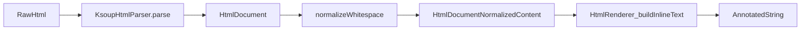

<!--firebender-plan
name: Whitespace normalisatie pipeline
overview: Introduceer een expliciete whitespace-normalisatiefase op `HtmlDocument`-niveau en verplaats whitespaceverantwoordelijkheid uit de renderer naar parser+normalizer, met veilige fallback als regressies optreden.
todos:
  - id: add-normalizer
    content: "Introduceer een `HtmlDocument.normalizeWhitespace()` implementatie in de parser-laag met recursieve child-normalisatie en context-aware spacingregels."
  - id: apply-block-rules
    content: "Implementeer block-boundary trimming voor heading/paragraph/blockquote/list-item nodes en merge van aangrenzende text nodes."
  - id: wire-pipeline
    content: "Integreer normalisatie direct na parse in `HtmlRenderer` en verwijder render-time whitespace normalisatie indien tests slagen."
  - id: add-regression-tests
    content: "Voeg gerichte whitespace regressietests toe voor inline boundaries, dubbele spaties, block edges en ` ` gedrag."
-->

# HTML whitespace normalisatie voor HtmlRenderer

## Doel
Whitespacebrowser-achtig gedrag realiseren door normalisatie **na parse/map** en **voor render**, met behoud van ` ` als expliciete regelafbreking.

## Huidige situatie (kort)
- Parse + map gebeurt in [`/Users/mitchellwit/IdeaProjects/htmlrenderer/htmlrenderer/src/commonMain/kotlin/org/privatespice/htmlrenderer/parser/KsoupHtmlParser.kt`](/Users/mitchellwit/IdeaProjects/htmlrenderer/htmlrenderer/src/commonMain/kotlin/org/privatespice/htmlrenderer/parser/KsoupHtmlParser.kt) en [`/Users/mitchellwit/IdeaProjects/htmlrenderer/htmlrenderer/src/commonMain/kotlin/org/privatespice/htmlrenderer/parser/HtmlNodeMapper.kt`](/Users/mitchellwit/IdeaProjects/htmlrenderer/htmlrenderer/src/commonMain/kotlin/org/privatespice/htmlrenderer/parser/HtmlNodeMapper.kt).
- Whitespace wordt nu nog in render genormaliseerd in [`/Users/mitchellwit/IdeaProjects/htmlrenderer/htmlrenderer/src/commonMain/kotlin/org/privatespice/htmlrenderer/HtmlRenderer.kt`](/Users/mitchellwit/IdeaProjects/htmlrenderer/htmlrenderer/src/commonMain/kotlin/org/privatespice/htmlrenderer/HtmlRenderer.kt) (`buildInlineText`, `InlineState`, `lineSpaceRegex`).

## Wijzigingsaanpak

### 1) Helpers en normalizer introduceren in parser-laag
- Voeg een nieuwe normalizer toe, bv. `HtmlWhitespaceNormalizer` onder `parser` package.
- Voeg typehelpers toe (in normalizer of als extensions), o.a.:
  - `isBlockNode(node)` voor block boundary trimming (`p`, `h1..h4`, `blockquote`, `li`)
  - `isInlineNode(node)` voor contextregels rond spaties
- Gebruik **zelfde type**: `HtmlDocument.normalizeWhitespace(): HtmlDocument`.

### 2) Recursieve normalisatie op children
- Eerst children recursief normaliseren (top-down per block/inline container).
- Daarna per sibling-lijst regels toepassen:
  - collapse whitespace in `HtmlTextNode` (`\s+` → `" "`)
  - verwijder whitespace-only text nodes waar toegestaan
  - merge adjacent text nodes
  - boundary-based spatiebehoud (links/rechts context)
- ` ` (`HtmlLineBreakNode`) nooit als gewone whitespace behandelen.

### 3) Block boundary trimming
- Voor block children-randen leading/trailing whitespace verwijderen aan begin/einde van block inhoud.
- Concreet op `HtmlHeadingNode`, `HtmlParagraphNode`, `HtmlBlockQuoteNode`, `HtmlListItemNode`.
- Binnen de content blijven noodzakelijke tussenruimtes bestaan via contextregels.

### 4) Integratie in pipeline
- In [`/Users/mitchellwit/IdeaProjects/htmlrenderer/htmlrenderer/src/commonMain/kotlin/org/privatespice/htmlrenderer/HtmlRenderer.kt`](/Users/mitchellwit/IdeaProjects/htmlrenderer/htmlrenderer/src/commonMain/kotlin/org/privatespice/htmlrenderer/HtmlRenderer.kt):
  - `parser.parse(html, supportedTags)` direct opvolgen met `.normalizeWhitespace()` (zelfde `HtmlDocument` type).
- Renderer vereenvoudigen:
  - verwijder render-time whitespace normalisatie (`trimLeadingNext`, `previousEndsWithSpace`, `lineSpaceRegex`) als gedrag correct blijft.
  - behoud enkel semantische handling (`HtmlLineBreakNode` → `"\n"`, styles/links).
- Veiligheidsnet: als regressiecases opduiken, tijdelijk minimale dedupe in renderer terugzetten (alleen als nodig).

### 5) Verificatie met gerichte tests
- Voeg tests toe onder parser/renderer testset (nieuwe testfiles indien nodig), minimaal voor:
  - indent/newline input zonder extra spaties
  - inline boundaries zonder woord-plakken
  - dubbele spaties collapsen
  - block edge trim
  - ` ` blijft line break
  - combinaties met links/emphasis/spans en list items

## Dataflow (doel)

## Belangrijkste bestanden
- [`/Users/mitchellwit/IdeaProjects/htmlrenderer/htmlrenderer/src/commonMain/kotlin/org/privatespice/htmlrenderer/parser/KsoupHtmlParser.kt`](/Users/mitchellwit/IdeaProjects/htmlrenderer/htmlrenderer/src/commonMain/kotlin/org/privatespice/htmlrenderer/parser/KsoupHtmlParser.kt)
- [`/Users/mitchellwit/IdeaProjects/htmlrenderer/htmlrenderer/src/commonMain/kotlin/org/privatespice/htmlrenderer/parser/HtmlTypedNodes.kt`](/Users/mitchellwit/IdeaProjects/htmlrenderer/htmlrenderer/src/commonMain/kotlin/org/privatespice/htmlrenderer/parser/HtmlTypedNodes.kt)
- [`/Users/mitchellwit/IdeaProjects/htmlrenderer/htmlrenderer/src/commonMain/kotlin/org/privatespice/htmlrenderer/HtmlRenderer.kt`](/Users/mitchellwit/IdeaProjects/htmlrenderer/htmlrenderer/src/commonMain/kotlin/org/privatespice/htmlrenderer/HtmlRenderer.kt)
- Nieuwe normalizer file in `.../parser/` (bijv. `HtmlWhitespaceNormalizer.kt`)

## Acceptatiecriteria
- Geen extra spaties door HTML-formatting/indentatie.
- Geen woord-plakken tussen inline nodes.
- Geen dubbele spaties in output.
- ` ` resulteert in expliciete regelafbreking.
- Renderer bevat geen dubbele whitespace-verantwoordelijkheid tenzij regressies dat tijdelijk vereisen.
